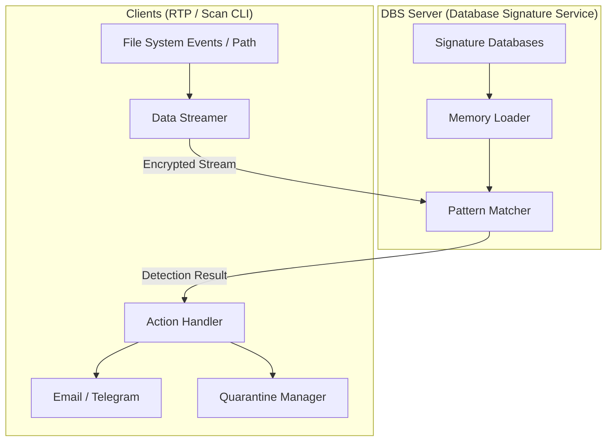

# 🛡️ Linux Malware Detect Next Generation (LMD-NG)

Welcome to the future of multi-platform security! **LMD-NG** is a complete, ground-up rewrite of the legendary **Linux Malware Detect (LMD/MalDet)**. Built with **Golang and CGO**, LMD-NG brings battle-tested security logic to **Linux**, **macOS**, and **Windows** with a modern, high-performance architecture. 🐹✨

LMD-NG utilizes a **Client-Server Architecture** to maximize efficiency. A centralized **Database Signature Service (DBS)** handles all heavy lifting—loading massive signature databases into memory once—while lightweight **Real-Time Protector (RTP)** clients and CLI tools stream data for lightning-fast matching.

---

## ✨ Why LMD-NG?

*   **⚡ Client-Server Architecture:** Centralized signature matching via **DBS** (server) while **RTP** and **On-Demand Scan** act as lightweight clients, reducing memory overhead across multiple nodes.
*   **🕵️ Real-Time Protection:** Native file system monitoring—**FSEvents** on macOS (via CGO/Zig) and **fsnotify** on Linux/Windows—catches threats the moment they land.
*   **🔍 On-Demand Scanning:** Perform manual, high-performance scans of any directory. Like the RTP, the scan CLI acts as a DBS client to leverage centralized, in-memory signatures.
*   **🔄 Intelligent Updates:** Automated signature updates with hot-reload support—the DBS server stays current without restarting active scans.
*   **📦 Native ClamAV Loader:** Built-in pure Go support for ClamAV databases (`.cvd`, `.cld`, `.ndb`, `.hdb`) with **zero** `libclamav` or `os/exec` dependencies.
*   **📥 Secure Quarantine:** Isolates threats with optional **AES-256 encryption** and full POSIX attribute preservation for safe restoration.
*   **🔒 Secure Streaming:** Clients communicate with the DBS server over encrypted TLS or Unix domain sockets using a custom high-performance binary protocol.
*   **📧 Multi-Channel Alerts:** Instant notifications via **Email (SMTP)** or **Telegram** when malware is detected.
*   **📊 Structured Logging:** Clean, modern observability using Go's native `slog`.
*   **🚀 Auto-Tuned System Limits:** Automatically optimizes file descriptor limits to ensure smooth performance during heavy scans.
*   **🌍 Truly Cross-Platform:** Native support for **Linux**, **macOS**, and **Windows**. No legacy bash dependencies.
*   **🛠️ Zig CGO Toolchain:** Compiled with `CGO_ENABLED=1` using the **Zig compiler** as a cross-platform C/C++ frontend. Zig provides a self-contained toolchain that makes cross-compilation effortless and reproducible compared to standard GCC or Clang.
---

## 🏗️ Architecture at a Glance



---

## 🚀 Getting Started

### 📋 Prerequisites

*   **Go** (1.21+)
*   **Make** (For Builds)
*   **Zig** (Required for Cross-Compilation CGO)

---

## 🛠️ Deployment

### 🐳 **Using Container**

1.  **Install Docker** following the [official guide](https://docs.docker.com/get-docker/).
2.  **Run the combined daemon:**
    ```sh
    docker run -d \
      -v /path/to/config.yaml:/usr/app/lmd-ng/config.yaml \
      -v /data/to/protect:/data:rw \
      --name lmd-ng \
      dimaskiddo/lmd-ng:latest
    ```

### 📦 **Using Pre-Built Binaries**

1.  Download the latest release from the [Releases Page](https://github.com/dimaskiddo/lmd-ng/releases).
2.  **Installation & Startup:**

#### 🐧 **Linux / 🍎 macOS**
```sh
# Give it execution power
chmod +x lmd-ng

# Update signature databases
./lmd-ng update

# Install services (requires sudo)
sudo ./lmd-ng service install dbs
sudo ./lmd-ng service install rtp

# Start services one-by-one
sudo ./lmd-ng service start dbs
sudo ./lmd-ng service start rtp
```

#### 🪟 **Windows**
*(Run from an Administrator Command Prompt)*
```powershell
# Update signature databases
.\lmd-ng.exe update

# Install services
.\lmd-ng.exe service install dbs
.\lmd-ng.exe service install rtp

# Start services one-by-one
.\lmd-ng.exe service start dbs
.\lmd-ng.exe service start rtp
```

### 🏗️ **Build From Source**

```sh
git clone https://github.com/dimaskiddo/lmd-ng.git
cd lmd-ng
make vendor
make build
# Binary is located in dist/lmd-ng
```

---

## 🕹️ Usage & Commands

LMD-NG is managed via a powerful CLI:

### 💂‍♂️ Daemon Services
*   **`lmd-ng daemon`**: Start both **DBS** (Server) and **RTP** (Client) in one process.
*   **`lmd-ng daemon dbs`**: Start only the Database Signature Service.
*   **`lmd-ng daemon rtp`**: Start only the Real-Time Protector (monitors file system).

### 🔍 Scanning & Updates
*   **`lmd-ng scan <path>`**: Perform an on-demand scan. Streams data to the local DBS.
*   **`lmd-ng update`**: Update signatures and trigger a hot-reload in the running DBS.

### 📥 Quarantine Management
*   **`lmd-ng quarantine list`**: List all quarantined files.
*   **`lmd-ng quarantine add <file>`**: Manually move a suspicious file into quarantine.
*   **`lmd-ng quarantine restore <id|path>`**: Safely restore a file to its original location with full attribute preservation.
*   **`lmd-ng quarantine remove <id|path>`**: Permanently delete a threat (requires `--force`).

### ⚙️ Service Management
Manage LMD-NG components as background services (Systemd, Launchd, or Windows Services). Operations require elevated privileges.

*   **Install Services**:
    *   `lmd-ng service install`: Register both **DBS** and **RTP** services.
    *   `lmd-ng service install dbs`: Register only the Database Signature Service (server).
    *   `lmd-ng service install rtp`: Register only the Real-Time Protector (client).
*   **Control Services**:
    *   `lmd-ng service start [dbs|rtp]`: Start services. If no component is specified, **DBS is started first**, followed by **RTP**.
    *   `lmd-ng service stop [dbs|rtp]`: Stop services. If no component is specified, **RTP is stopped first**, followed by **DBS**.
    *   `lmd-ng service restart [dbs|rtp]`: Restart services. If no component is specified, **DBS is restarted first**, followed by **RTP**.
*   **Uninstall Services**:
    *   `lmd-ng service uninstall`: Stop and remove both **DBS** and **RTP** services. If no component is specified, **RTP is uninstalled first**, followed by **DBS**.
    *   `lmd-ng service uninstall dbs`: Stop and remove only the Database Signature Service (server).
    *   `lmd-ng service uninstall rtp`: Stop and remove only the Real-Time Protector (client).

---

## 🧪 Testing

```sh
go test ./...
```
*Note: Integration tests validate the compiled binary in `dist/`.*

---

## ✍️ Authors

*   **Dimas Restu Hidayanto** - *Initial Work & Architecture* - [DimasKiddo](https://github.com/dimaskiddo)

---

## 🏗️ Built With Love & Power

*   **[Go](https://golang.org/)** - The engine behind LMD-NG.
*   **[Zig](https://ziglang.org/)** - The cross-compilation powerhouse for CGO.
*   **[Cobra](https://github.com/spf13/cobra)** - Modern CLI framework.
*   **[fsnotify/fsnotify](https://github.com/fsnotify/fsnotify)** - Cross-platform file system watcher for Linux and Windows.
*   **[fsnotify/fsevents](https://github.com/fsnotify/fsevents)** - Native FSEvents watcher for macOS.
*   **[kardianos/service](https://github.com/kardianos/service)** - Multi-platform service manager.

---

## ⚖️ License

Distributed under the **MIT License**. See `LICENSE` for more information.

---
**LMD-NG** — *Next Generation Security for a Modern World.* 🛡️🌐
