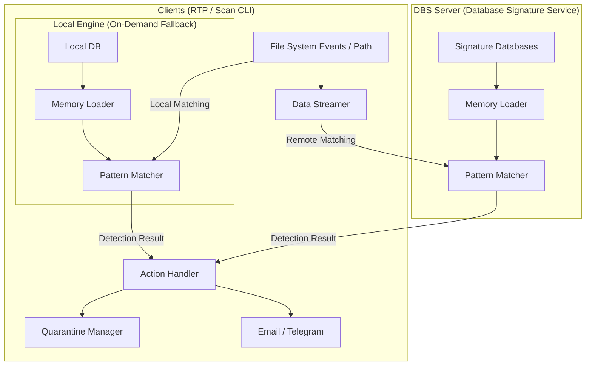

# 🛡️ Linux Malware Detect Next Generation (LMD-NG)

**LMD-NG** is a ground-up rewrite of **Linux Malware Detect (LMD/MalDet)**. Built with **Golang and CGO**, LMD-NG brings security logic to **Linux**, **macOS**, and **Windows** with a client-server architecture.

A centralized **Database Signature Service (DBS)** loads signature databases into memory once, while lightweight **Real-Time Protector (RTP)** clients and CLI tools stream data for matching.

---

## ✨ Why LMD-NG?

*   **⚡ Client-Server Architecture:** Centralized signature matching via **DBS** (server) while **RTP** and **On-Demand Scan** act as lightweight clients, reducing memory overhead across multiple nodes.
*   **🕵️ Real-Time Protection:** Native file system monitoring—**FSEvents** on macOS (via CGO/Zig) and **fsnotify** on Linux/Windows.
*   **🔍 On-Demand Scanning:** Manual scans of any directory. Scan CLI acts as a DBS client for centralized, in-memory signatures.
*   **🔄 Intelligent Updates:** Automated signature updates with hot-reload—DBS stays current without restarting active scans.
*   **⬆️ Self-Upgrade:** One-command binary upgrade from GitHub releases. Downloads, stops services, replaces binary, restarts. Linux/macOS: atomic inode swap. Windows: batch trampoline for locked `.exe`.
*   **📊 Status Dashboard:** `lmd-ng status` shows DBS reachability, engine signature counts (MD5, SHA256, HEX, RFXN, ClamAV HDB/NDB/MDB), CVD database versions, quarantine count, RTP paths, and scheduler config.
*   **📦 Native ClamAV Loader:** Pure Go support for ClamAV databases (`.cvd`, `.cld`, `.ndb`, `.hdb`, `.mdb`). No `libclamav` or `os/exec` dependencies.
*   **📥 Secure Quarantine:** AES-256-GCM encryption, POSIX attribute preservation, short-ID lookup.
*   **🔒 Secure Streaming:** TLS mutual authentication over Unix domain sockets or TCP.
*   **📧 Multi-Channel Alerts:** Email (SMTP) and Telegram notifications on quarantine events.
*   **📊 Structured Logging:** Go `slog` with lumberjack rotation.
*   **🚀 Auto-Tuned System Limits:** Automatically optimizes file descriptor limits for heavy scans.
*   **🌍 Cross-Platform:** Linux, macOS, Windows. No legacy bash dependencies.
*   **🛠️ Zig CGO Toolchain:** Compiled with `CGO_ENABLED=1` using the **Zig compiler** for reproducible cross-platform builds.
---

## 🏗️ Architecture at a Glance


```mermaid
graph TD
    subgraph "DBS Server (Database Signature Service)"
        DB_S["Signature Databases"] --> Engine_S["Memory Loader"]
        Engine_S --> Matcher_S["Pattern Matcher"]
    end

    subgraph "Clients (RTP / Scan CLI)"
        Source["File System Events / Path"]
        
        subgraph "Local Engine (On-Demand Fallback)"
            DB_L["Local DB"] --> Engine_L["Memory Loader"]
            Engine_L --> Matcher_L["Pattern Matcher"]
        end

        Streamer["Data Streamer"]
        
        Source --> Streamer
        Streamer -- "Remote Matching" --> Matcher_S
        Source -- "Local Matching" --> Matcher_L
        
        Matcher_S -- "Detection Result" --> ActionHandler["Action Handler"]
        Matcher_L -- "Detection Result" --> ActionHandler
        
        ActionHandler --> Notifier["Email / Telegram"]
        ActionHandler --> Quarantine["Quarantine Manager"]
    end
```

---

## ⚠️ Upgrading

> **Quarantine encryption format changed (after v0.2.0) — breaking for files quarantined with encryption enabled.**
>
> Quarantined files created with `enable_encryption: true` on versions after v0.2.0 use a
> broken encryption format (nonce reuse across 4KB chunks). Files larger than 4KB were
> never correctly encrypted and **cannot be restored**. Files smaller than 4KB may appear
> to decrypt but their authentication tags are invalid.
>
> **Before upgrading**, check your quarantined files. If you are not sure which files
> were affected, you can try restoring them first:
>
> ```sh
> lmd-ng quarantine list
> lmd-ng quarantine restore <id>
> ```
>
> If restoration fails or you want to clean up, remove the affected files:
>
> ```sh
> lmd-ng quarantine remove --force <id>
> ```
>
> **Unencrypted quarantine files are unaffected** — they were never encrypted and can be
> restored normally after upgrading.

---

## 🚀 Getting Started

### 📋 Prerequisites

*   **Go** (1.21+)
*   **Make** (For Builds)
*   **Zig** (Required for Cross-Compilation CGO)

---

## 🛠️ Deployment

### 🐳 **Using Container**

1.  **Install Docker** following the [official guide](https://docs.docker.com/get-docker/).
2.  **Run the combined daemon:**
    ```sh
    docker run -d \
      -v /data/to/protect:/data:rw \
      -v /path/to/config.yaml:/usr/local/lmd-ng/config.yaml \
      --name lmd-ng \
      dimaskiddo/lmd-ng:latest
    ```

### 📦 **Using Pre-Built Binaries**

1.  Download the latest release from the [Releases Page](https://github.com/dimaskiddo/lmd-ng/releases).
2.  **Installation & Startup:**

#### 🐧 **Linux / 🍎 macOS**
```sh
chmod +x lmd-ng

# Update signature databases
./lmd-ng update

# Install services (requires sudo)
sudo ./lmd-ng service install dbs
sudo ./lmd-ng service install rtp

# Start services one-by-one
sudo ./lmd-ng service start dbs
sudo ./lmd-ng service start rtp
```

#### 🪟 **Windows**
*(Run from an Administrator Command Prompt)*
```powershell
# Update signature databases
.\lmd-ng.exe update

# Install services
.\lmd-ng.exe service install dbs
.\lmd-ng.exe service install rtp

# Start services one-by-one
.\lmd-ng.exe service start dbs
.\lmd-ng.exe service start rtp
```

### 🏗️ **Build From Source**

```sh
git clone https://github.com/dimaskiddo/lmd-ng.git
cd lmd-ng
make vendor
make build
# Binary is located in dist/lmd-ng
```

---

## 🕹️ Usage & Commands

LMD-NG is managed via a CLI:

### 💂‍♂️ Daemon Services
*   **`lmd-ng daemon`**: Start both **DBS** (Server) and **RTP** (Client) in one process.
*   **`lmd-ng daemon dbs`**: Start only the Database Signature Service.
*   **`lmd-ng daemon rtp`**: Start only the Real-Time Protector (monitors file system).

### 🔍 Scanning & Updates
*   **`lmd-ng scan <path>`**: Perform an on-demand scan. Streams data to the local DBS.
*   **`lmd-ng update`**: Update signatures and trigger a hot-reload in the running DBS.
*   **`lmd-ng upgrade [--force]`**: Self-upgrade binary from GitHub releases. Without `--force`, exits early if already up-to-date.
*   **`lmd-ng status`**: Display DBS reachability, signature counts, CVD versions, quarantine, RTP config.
*   **`lmd-ng version`**: Display binary version and commit hash.

### 📥 Quarantine Management
*   **`lmd-ng quarantine list`**: List all quarantined files.
*   **`lmd-ng quarantine add <file>`**: Manually move a suspicious file into quarantine.
*   **`lmd-ng quarantine restore <id|path>`**: Safely restore a file to its original location with full attribute preservation.
*   **`lmd-ng quarantine remove <id|path>`**: Permanently delete a threat (requires `--force`).

### ⚙️ Service Management
Manage LMD-NG components as background services (Systemd, Launchd, or Windows Services). Operations require elevated privileges.

*   **Install Services**:
    *   `lmd-ng service install`: Register both **DBS** and **RTP** services.
    *   `lmd-ng service install dbs`: Register only the Database Signature Service (server).
    *   `lmd-ng service install rtp`: Register only the Real-Time Protector (client).
*   **Control Services**:
    *   `lmd-ng service start [dbs|rtp]`: Start services. If no component is specified, **DBS is started first**, followed by **RTP**.
    *   `lmd-ng service stop [dbs|rtp]`: Stop services. If no component is specified, **RTP is stopped first**, followed by **DBS**.
    *   `lmd-ng service restart [dbs|rtp]`: Restart services. If no component is specified, **DBS is restarted first**, followed by **RTP**.
*   **Uninstall Services**:
    *   `lmd-ng service uninstall`: Stop and remove both **DBS** and **RTP** services. If no component is specified, **RTP is uninstalled first**, followed by **DBS**.
    *   `lmd-ng service uninstall dbs`: Stop and remove only the Database Signature Service (server).
    *   `lmd-ng service uninstall rtp`: Stop and remove only the Real-Time Protector (client).

---

## 🧪 Testing

```sh
go test ./...
```
*Note: Integration tests validate the compiled binary in `dist/`.*

---

## ✍️ Authors

*   **Dimas Restu Hidayanto** - *Initial Work & Architecture* - [DimasKiddo](https://github.com/dimaskiddo)

---

## 🏗️ Dependencies

*   **[Go](https://golang.org/)**
*   **[Zig](https://ziglang.org/)** - CGO cross-compilation
*   **[Cobra](https://github.com/spf13/cobra)** - CLI framework
*   **[Viper](https://github.com/spf13/viper)** - YAML configuration with hot-reload
*   **[robfig/cron](https://github.com/robfig/cron)** - Scheduling for updates and scans
*   **[fsnotify/fsnotify](https://github.com/fsnotify/fsnotify)** - File system watcher (Linux/Windows)
*   **[fsnotify/fsevents](https://github.com/fsnotify/fsevents)** - FSEvents watcher (macOS)
*   **[kardianos/service](https://github.com/kardianos/service)** - OS service management
*   **[natefinch/lumberjack](https://github.com/natefinch/lumberjack)** - Log rotation

---

## ⚠️ Disclaimer

**DO WITH YOUR OWN RISK (DWYOR)**. This software is provided "as is", without warranty of any kind, express or implied. Use of this software may involve risks, including but not limited to system instability or data loss. The authors are not responsible for any damage caused by the use of this application.

---

## ⚖️ License

Distributed under the **MIT License**. See `LICENSE` for more information.

---
**LMD-NG** — *Next Generation Security for a Modern World.* 🛡️🌐
