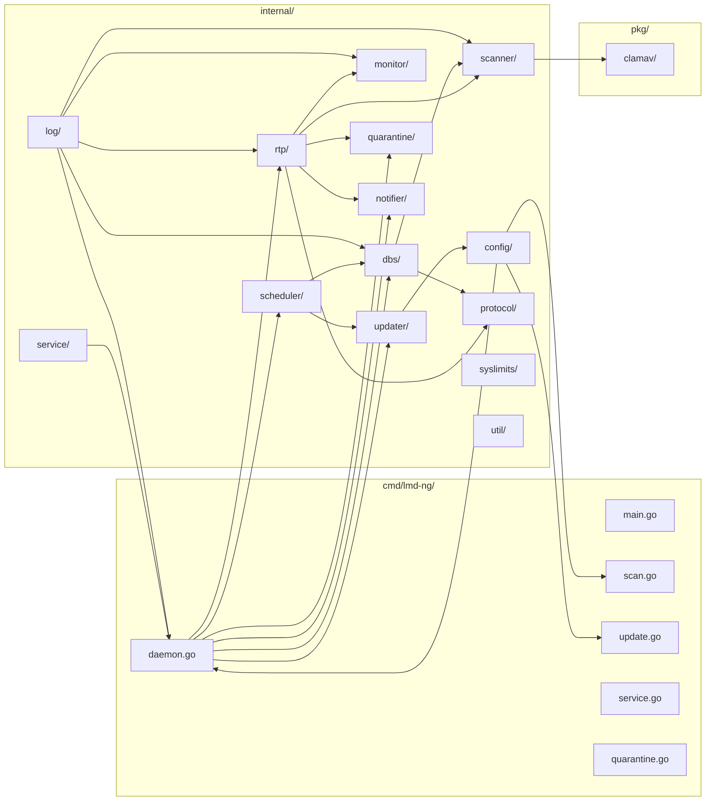
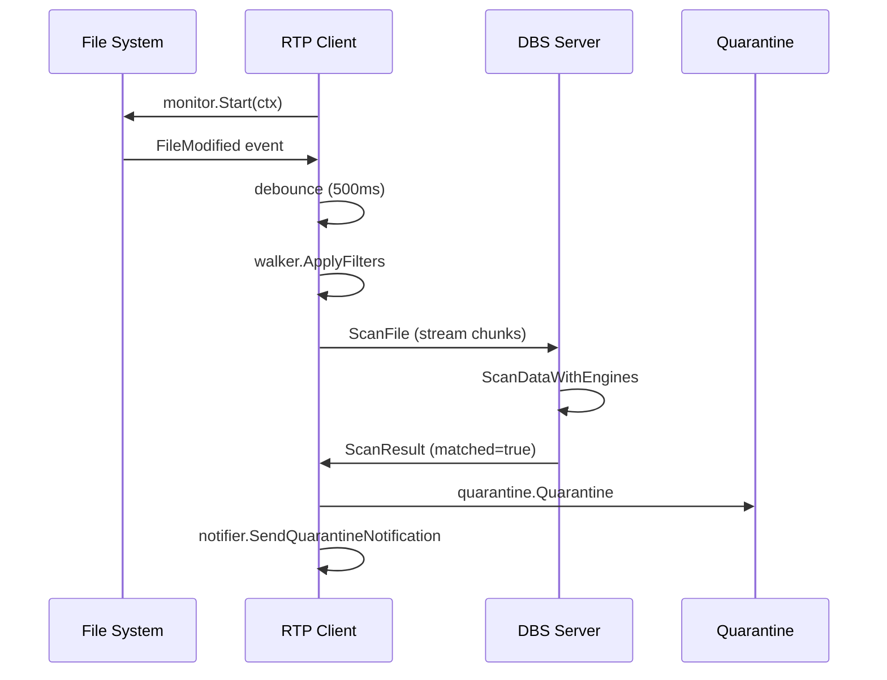
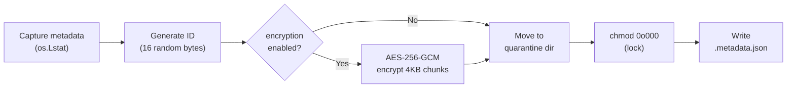

# LMD-NG — Architecture

Cross-platform malware detection system in Go: real-time file monitoring, signature scanning, and quarantine. Two-process model (DBS server + RTP client) communicating over encrypted protocol. Pure-Go signature matching — no `os/exec` in core. **Config defaults:** see `config.yaml.example` — never guess values.

---

## Module Map



---

## 1. DBS / RTP Architecture

Two-process model: **DBS** owns signature databases and scan execution, **RTP** owns filesystem monitoring and quarantine.



| Component | Package | Role |
|---|---|---|
| **DBS** | `internal/dbs/` | Signature server — holds engines, accepts scan requests, returns results |
| **RTP** | `internal/rtp/` | FS monitor — watches paths, streams changes to DBS, handles quarantine locally |
| **Scanner** | `internal/scanner/` | Engine interface + LMD/ClamAV scanners + walker + coordinator |
| **Monitor** | `internal/monitor/` | Platform-specific FS events (FSEvents macOS, fsnotify Linux/Windows) |
| **Protocol** | `internal/protocol/` | Binary wire format over TLS (unix socket or TCP) |
| **Quarantine** | `internal/quarantine/` | AES-256-GCM encrypt, POSIX metadata capture, short-ID lookup |
| **Updater** | `internal/updater/` | Download LMD/ClamAV signatures, version check, atomic install |
| **Scheduler** | `internal/scheduler/` | Cron-based update + scan scheduling |
| **Notifier** | `internal/notifier/` | Email (SMTP) + Telegram on quarantine events |
| **Service** | `internal/service/` | OS service install via `kardianos/service` |
| **Config** | `internal/config/` | YAML via Viper, path resolution, SIGHUP hot-reload |
| **Log** | `internal/log/` | `log/slog` + lumberjack rotation, dual stdout+file output |

---

## 2. Protocol (`internal/protocol/protocol.go`)

Binary wire format: `[1-byte type][4-byte length BE][payload]`

| Code | Name | Direction | Payload |
|---|---|---|---|
| 0x01 | `MsgScanRequest` | client→server | `[4-byte path len][path][8-byte filesize]` |
| 0x02 | `MsgScanChunk` | client→server | Raw bytes (≤ 32KB) |
| 0x03 | `MsgScanEnd` | client→server | Empty |
| 0x04 | `MsgScanResult` | server→client | `[1-byte matched][4-byte count][entries...]` |
| 0x05 | `MsgError` | either | UTF-8 error string |
| 0x06 | `MsgPing` | client→server | Empty |
| 0x07 | `MsgPong` | server→client | Empty |
| 0x08 | `MsgReloadSignatures` | client→server | Empty |
| 0x09 | `MsgReloadAck` | server→client | Empty |

**Limits:** `MaxChunkSize` = 32KB, `MaxPayloadSize` = 1MB. TLS mandatory (`tls.VersionTLS13`, mutual auth).

---

## 3. Scanner (`internal/scanner/`)

### SignatureEngine Interface

```go
type SignatureEngine interface {
    Scan(ctx context.Context, r io.ReadSeeker, filePath string) ([]*ScanResult, error)
    Name() string
}
```

### LMDSignatureScanner

Composed of 4 sub-scanners — scan order: **MD5 → SHA256 → RFXN → HEX**, short-circuits on first match.

| Sub-scanner | Source | Matching |
|---|---|---|
| **MD5** | `signatures/dat/md5*.dat` + `custom.md5` | `map[string]string` hash→name lookup |
| **SHA256** | `signatures/dat/sha256*.dat` + `custom.sha256` | `map[string]string` hash→name lookup |
| **RFXN** | `signatures/rfxn/` via `pkg/clamav` | HDB (file size + hash) + NDB (hex body patterns, depth 64KB) |
| **HEX** | `signatures/dat/hex*.dat` + `custom.hex` | `bytes.Contains` on decoded hex patterns (depth 20KB) |

**Guards:**
- `HashAllowlistPaths`: files under these prefixes skip hash detection (protects `/usr/bin/*`)
- `magic.go`: ELF/Mach-O/PE detection — Windows-targeted sigs (prefixed `Win.`, `Trojan.Win`) skipped on non-PE files

### ClamAVSignatureEngine

Two-pass scan: **Hash phase** (single-pass MD5+SHA1+SHA256 via `io.MultiWriter`, HDB lookup) → **Body phase** (read to 64KB, NDB pattern matching).

### Walker (`internal/scanner/walker.go`)

Filter pipeline applied per file:

1. Resolve symlinks via `os.Stat`
2. Skip non-regular files
3. Min/max file size check
4. Owner filters (Unix: UID/GID via `syscall.Stat_t`; Windows: no-op)
5. Exclude regex check
6. Include regex check (if set)

Platform-specific: `walker_unix.go` (`applyOwnerFilters` — UID/GID), `walker_windows.go` (no-op).

---

## 4. Quarantine (`internal/quarantine/quarantine.go`)

### Flow



### Metadata Structure

| Field | Source |
|---|---|
| `OriginalPath` | Source file absolute path |
| `QuarantinePath` | `<quarantine_dir>/<basename>.<32-char-hex>.quarantined` |
| `DetectionInfo` | Signature name that matched |
| `DetectionEngine` | Engine that detected (LMD/ClamAV) |
| `FileMode` | Full permission bits (including setuid/setgid/sticky) |
| `UID/GID` | Owner/group (Unix only; Windows: 0) |
| `ModTime` | Original modification time |
| `FileSize` | Original file size |
| `EncryptionKey` | Encrypted AES file key (master key = SHA-256 of config password) |

### Restore Flow

Read metadata → `chmod 0o400` to open → decrypt (if encrypted) → atomic move to original path → restore POSIX attributes (mode → ownership → mtime) → delete quarantine file + sidecar.

### Short-ID Lookup

Minimum 4 characters. Scans `*.quarantined` files, extracts hex ID after last `.` in basename. Returns unique match or errors on ambiguity.

---

## 5. Configuration (`internal/config/`)

### Config Sections

| Section | Purpose |
|---|---|
| `app` | Base paths: signatures, clamav, quarantine, logs |
| `logging` | Level, output mode, file path, lumberjack rotation |
| `server` | Network (unix/tcp), socket/address, connection pool, TLS |
| `quarantine` | Enabled, path, encryption key |
| `monitor` | Watch paths, exclude dirs (auto-appended: sigs, clamav, quarantine, logs) |
| `scanner` | Signature path, clamav toggle, file size/depth filters, CPU limits, owner/regex filters |
| `scheduler` | Update interval (cron), scan interval (cron) |
| `updater` | Auto-update, LMD URLs, ClamAV mirror/databases |
| `notification` | Email (SMTP) + Telegram (Bot API) |

### Search Order

1. `--config <path>` flag (if provided)
2. Binary's directory (resolved via `os.Executable` + symlink resolution)
3. `/etc/lmd-ng/`
4. `/usr/local/etc/lmd-ng/`
5. `/usr/local/lmd-ng/`

### Hot-Reload (SIGHUP)

Daemon spawns goroutine listening for `syscall.SIGHUP`. On signal: re-read YAML via Viper → unmarshal into fresh `Config` → resolve paths → swap atomically. DBS server rebuilds engines via `EngineFactory`.

---

## 6. Notification (`internal/notifier/`)

Triggered on: **quarantine events only** (file detected + encrypted + moved).

| Provider | Implementation |
|---|---|
| **Email** | HTML email via SMTP. Subject: `[LMD-NG Alert] Malware Quarantined on <hostname>`. Two modes: direct TLS (port 465) or STARTTLS + `PlainAuth`. |
| **Telegram** | POST to `api.telegram.org/bot<token>/sendMessage`. HTML-formatted message with host, time, file path, signature name. |

`MultiNotifier` checks internet connectivity before dispatch. Silently drops if offline. Aggregates errors from all providers.

---

## 7. Service (`internal/service/`)

### Components

| Service Name | Component | Description |
|---|---|---|
| `lmd-ng-dbs` | `dbs` | Database Signature Server |
| `lmd-ng-rtp` | `rtp` | Real-Time Protector |

### Install Flow

Privilege check (Unix: UID==0; Windows: `Token.IsElevated()`) → resolve executable path → build `kardianos/service.Config` with `Arguments: ["daemon", "<component>"]` → platform config → `svc.Install()`.

### Platform Differences

| Aspect | Linux | macOS | Windows |
|---|---|---|---|
| Restart | systemd `Restart=always` | launchd `KeepAlive=true` | SCM `OnFailure=restart` |
| File limits | `LimitNOFILE=infinity` | `NumberOfFiles: 8192000` | N/A |
| Process limits | `LimitNPROC=infinity` | `NumberOfProcesses: 512` | N/A |

---

## 8. Cross-Platform Concerns

| Concern | Solution |
|---|---|
| FS monitoring | FSEvents (macOS CGO), fsnotify (Linux/Windows) |
| File ownership | `syscall.Stat_t` (Unix), no-op (Windows) |
| File paths | `filepath.Join()` everywhere — no hardcoded separators |
| Socket default | Unix socket (non-Windows), TCP (Windows) |
| Service mgmt | systemd (Linux), launchd (macOS), SCM (Windows) |
| Build | Zig CC cross-compilation via `hack/zcc.sh` |

---

## 9. Key Design Decisions

1. **No `os/exec` in core** — file traversal via `filepath.WalkDir`, monitoring via `fsnotify`/`fsevents`, signatures via Go `crypto` + `pkg/clamav`
2. **DBS/RTP split** — signature engine runs as server, monitor as client. Enables multi-host deployments, shared signature database
3. **Streaming I/O** — files read via `os.Open` + `io.Reader` in 32KB chunks. Never `os.ReadFile` on target files
4. **AES-256-GCM quarantine** — streaming 4KB chunk encryption, random per-file key, master key derived from config password via SHA-256
5. **Hot-swap engines** — DBS holds engines behind `sync.RWMutex`. In-flight scans use snapshot; reload swaps atomically
6. **Short-circuit scan** — engines tried sequentially; first positive match returns immediately
7. **Permission resiliency** — walker never crashes on `os.ErrPermission`. Log at Warn/Debug, continue to next file
8. **Stdlib first** — minimal third-party deps. Zig CC for CGO cross-compilation, not raw gcc/clang
9. **Dual output logging** — `slog` structured logging with lumberjack rotation, simultaneous stdout + file via `io.MultiWriter`
10. **Config paths relative to binary** — all paths resolved from binary's real directory, not CWD. Avoids ambiguity in daemon/service mode
