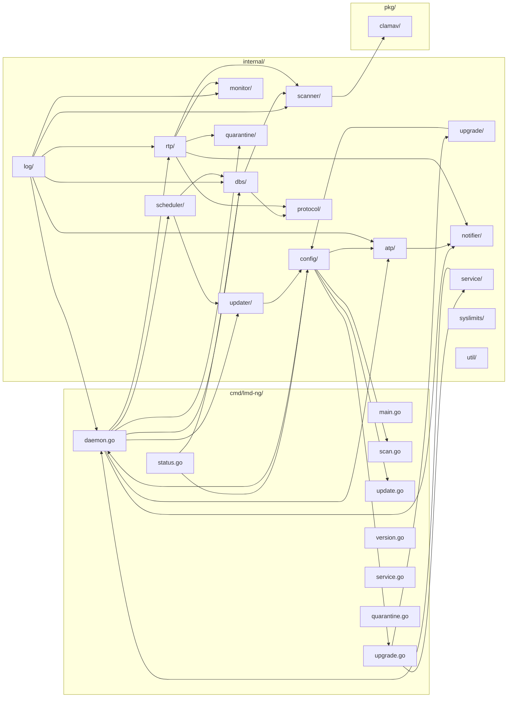
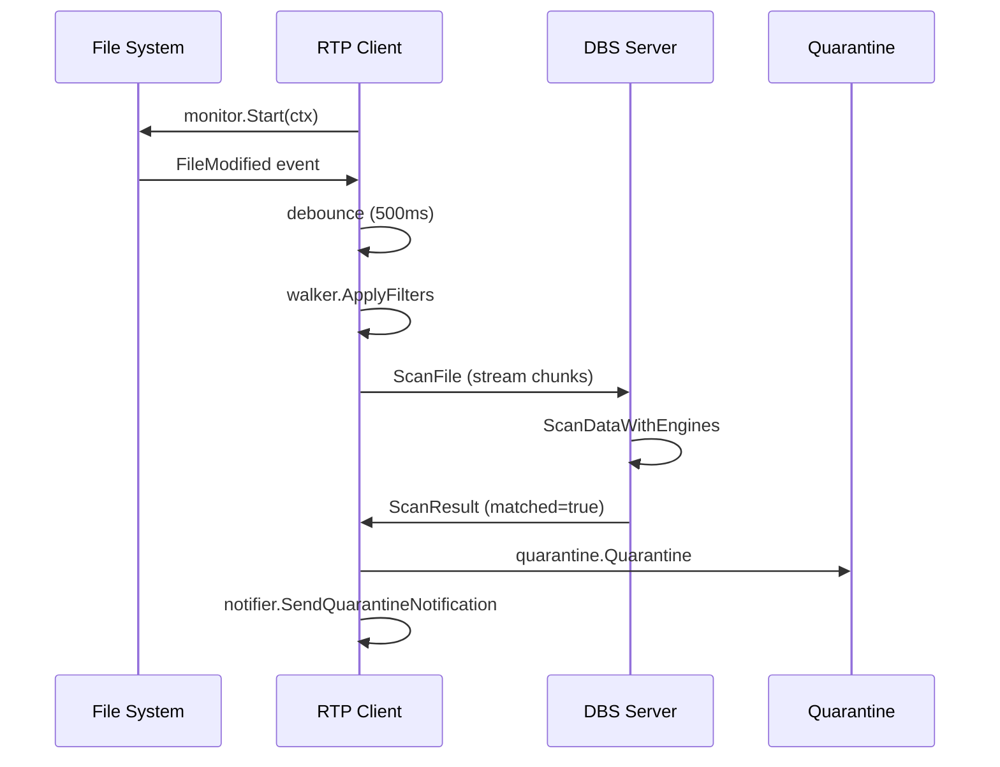
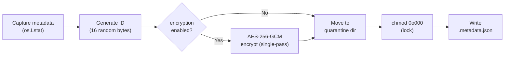
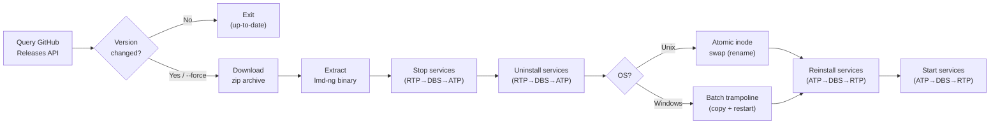

# LMD-NG — Architecture

Cross-platform malware detection system in Go: real-time file monitoring, signature scanning, and quarantine. Two-process model (DBS server + RTP client) communicating over encrypted protocol. Pure-Go signature matching — no `os/exec` in core. **Config defaults:** see `config.yaml.example` — never guess values.

---

## Module Map



---

## 1. DBS / RTP Architecture

Two-process model: **DBS** owns signature databases and scan execution, **RTP** owns filesystem monitoring and quarantine.



| Component | Package | Role |
|---|---|---|
| **ATP** | `internal/atp/` | Anti-Tamper Protection — locks critical files via OS-level immutable/deny mechanisms. Linux: `chattr +i` + fanotify FAN_DENY + inotify detection. macOS: `chflags SF_IMMUTABLE` + periodic recheck. Windows: deny-write DACL + audit SACL + exclusive handles. |
| **DBS** | `internal/dbs/` | Signature server — holds engines, accepts scan requests, returns results |
| **RTP** | `internal/rtp/` | FS monitor — watches paths, streams changes to DBS, handles quarantine locally |
| **Scanner** | `internal/scanner/` | Engine interface + LMD/ClamAV scanners + walker + coordinator |
| **Monitor** | `internal/monitor/` | Platform-specific FS events (FSEvents macOS, fsnotify Linux/Windows) |
| **Protocol** | `internal/protocol/` | Binary wire format over TLS (unix socket or TCP) |
| **Quarantine** | `internal/quarantine/` | AES-256-GCM encrypt, POSIX metadata capture, short-ID lookup |
| **Updater** | `internal/updater/` | Download LMD/ClamAV signatures, version check, atomic install |
| **Upgrade** | `internal/upgrade/` | Binary self-upgrade — GitHub Releases API, zip extraction, platform-specific swap |
| **Scheduler** | `internal/scheduler/` | Cron-based update + scan scheduling |
| **Notifier** | `internal/notifier/` | Email (SMTP), Telegram (Bot API), Discord (webhook), Slack (incoming webhook) on quarantine events |
| **Service** | `internal/service/` | OS service install via `kardianos/service` |
| **Config** | `internal/config/` | YAML via Viper, path resolution, SIGHUP hot-reload |
| **Log** | `internal/log/` | `log/slog` + lumberjack rotation, dual stdout+file output. `InitLoggerWithPath` splits per-component logs (ATP/DBS/RTP/scan), all sharing the same rotation config |

---

## 2. Protocol (`internal/protocol/protocol.go`)

Binary wire format: `[1-byte type][4-byte length BE][payload]`

| Code | Name | Direction | Payload |
|---|---|---|---|
| 0x01 | `MsgScanRequest` | client→server | `[4-byte path len][path][8-byte filesize]` |
| 0x02 | `MsgScanChunk` | client→server | Raw bytes (≤ 32KB) |
| 0x03 | `MsgScanEnd` | client→server | Empty |
| 0x04 | `MsgScanResult` | server→client | `[1-byte matched][4-byte count][entries...]` |
| 0x05 | `MsgError` | either | UTF-8 error string |
| 0x06 | `MsgPing` | client→server | Empty |
| 0x07 | `MsgPong` | server→client | Empty |
| 0x08 | `MsgReloadSignatures` | client→server | Empty |
| 0x09 | `MsgReloadAck` | server→client | Empty |
| 0x0A | `MsgStatusRequest` | client→server | Empty |
| 0x0B | `MsgStatusResponse` | server→client | JSON-encoded `StatusData` |

**Limits:** `MaxChunkSize` = 32KB, `MaxPayloadSize` = 1MB. TLS mandatory (`tls.VersionTLS13`, mutual auth). Auto-generated certs use ECDSA P-256.

**Note:** `MsgReloadSignatures`/`MsgReloadAck` are used by `lmd-ng update` to notify a running DBS server to reload engines after signature download.

---

## 2.5. ATP — Anti-Tamper Protection (`internal/atp/`)

Prevents malware from modifying or deleting LMD-NG's own files (binary, config, signatures, TLS certs, quarantine).

### Startup Order

ATP starts FIRST to lock files before DBS loads signatures. On shutdown, ATP releases LAST so files remain protected for as long as any LMD-NG service is running. Order: ATP → DBS → RTP at startup; RTP → DBS → ATP at shutdown.

### Platform Layers

| Platform | Layer 1: Static | Layer 2: Active | Layer 3: Detection |
|---|---|---|---|
| **Linux** | `ioctl FS_IOC_SETFLAGS` sets `FS_IMMUTABLE_FL` (chattr +i equivalent, pure Go syscall) | fanotify FAN_OPEN_PERM listener denies write opens on protected inodes | inotify watcher detects chattr -i, re-applies immutable flag; periodic recheck every 5 min |
| **macOS** | `chflags SF_IMMUTABLE` via raw syscall (pure Go) | — (cannot be bypassed without single-user mode/SIP disabled) | Periodic recheck every 5 min |
| **Windows** | Deny-write DACL + audit SACL via `SetNamedSecurityInfo` | Exclusive file handles (dwShareMode=0) via `CreateFile` | Periodic recheck every 5 min |

### Self-Upgrade

ATP supports unlock/lock via control channel. Before binary replacement during upgrade, `ReleaseAll()` clears immutable flags and fanotify marks. After replacement, protections are re-applied.

### Config

ATP is always-on — no config toggles. Protected files are auto-derived: binary (via `os.Executable`), config (all standard locations), signatures dir, TLS certs dir, quarantine dir, and ClamAV DBs (only when `clamav_enabled: true`).

---

## 3. Scanner (`internal/scanner/`)

### SignatureEngine Interface

```go
type SignatureEngine interface {
    Scan(ctx context.Context, r io.ReadSeeker, filePath string) ([]*ScanResult, error)
    Name() string
}
```

### HeuristicScanner Interface (optional)

```go
// HeuristicScanner is an optional interface for heuristic pattern matching.
// Engines implementing it are called in a separate second pass after all engines
// complete their deterministic hash-based Scan pass.
type HeuristicScanner interface {
    ScanHeuristics(ctx context.Context, r io.ReadSeeker, filePath string) ([]*ScanResult, error)
}
```

### LMDSignatureScanner

Dispatched in two passes by `ScanDataWithEngines`:

**Pass 1 — `Scan()` (deterministic, hash-only):**
MD5 → SHA256 → RFXN HDB (MD5/SHA1/SHA256 file-hash lookup) → RFXN MDB (PE section hash). Short-circuits on first match. SHA1 computed alongside MD5+SHA256 in single `io.MultiWriter` pass.

**Pass 2 — `ScanHeuristics()` (pattern-based, gated by `enabled_heuristics`):**
HEX → RFXN NDB. Only runs if no hash match was found in Pass 1. Short-circuits on first match.

| Sub-scanner | Source | Matching | Pass |
|---|---|---|---|
| **MD5** | `signatures/dat/md5*.dat` + `custom.md5` | `map[string]string` hash→name lookup | 1 (Scan) |
| **SHA256** | `signatures/dat/sha256*.dat` + `custom.sha256` | `map[string]string` hash→name lookup | 1 (Scan) |
| **RFXN HDB** | `signatures/rfxn/` via `pkg/clamav` | File-size-gated MD5/SHA1/SHA256 hash lookup | 1 (Scan) |
| **RFXN MDB** | `signatures/rfxn/` via `pkg/clamav` | PE section hash lookup (PE files only) | 1 (Scan) |
| **HEX** | `signatures/dat/hex*.dat` + `custom.hex` | `bytes.Contains` + wildcard matching (depth 256KB) | 2 (ScanHeuristics) |
| **RFXN NDB** | `signatures/rfxn/` via `pkg/clamav` | Body hex patterns (depth 256KB) | 2 (ScanHeuristics) |

**Guards:**
- `HashAllowlistPaths`: files under these prefixes skip hash detection (protects `/usr/bin/*`)
- `magic.go`: ELF/Mach-O/PE detection via `isNativeExecutable` + `isUnixTargetedSig`. On ELF/Mach-O files, only signatures with Unix prefixes (`Unix.`, `Linux.`, `Osx.`, `MacOS.`, `ELF.`, `Mach-O.`) are applied; cross-platform and Windows-specific signatures are skipped.
- HEX and NDB heuristic sub-scanners gated by `enabled_heuristics` config. Default: `["hex"]`. Add `"ndb"` to enable NDB body-pattern matching (accepts FP risk).

### ClamAVSignatureEngine

Dispatched in two passes by `ScanDataWithEngines`:

**Pass 1 — `Scan()` (deterministic, hash-only):**
Single-pass hash computation (MD5+SHA1+SHA256 via `io.MultiWriter`) → HDB lookup → PE section detection (MDB lookup for PE files only). Short-circuits on first match.

**Pass 2 — `ScanHeuristics()` (pattern-based, gated by `enabled_heuristics: ["ndb"]`):**
Reads first `clamav_hex_depth` bytes (default 64KB), runs NDB body-pattern matching. Only runs if no hash match was found in Pass 1 and `"ndb"` is in `enabled_heuristics`.

| Sub-scanner | Source | Matching | Pass | Gated By |
|---|---|---|---|---|
| **ClamAV HDB** | ClamAV CVD via `pkg/clamav` | File-size-gated MD5/SHA1/SHA256 hash lookup | 1 (Scan) | `clamav_enabled` |
| **ClamAV MDB** | ClamAV CVD via `pkg/clamav` | PE section hash lookup (PE files only) | 1 (Scan) | `clamav_enabled` |
| **ClamAV NDB** | ClamAV CVD via `pkg/clamav` | Body hex patterns (depth `clamav_hex_depth`) | 2 (ScanHeuristics) | `clamav_enabled` + `enabled_heuristics: ["ndb"]` |

### Walker (`internal/scanner/walker.go`)

Filter pipeline applied per file:

1. Resolve symlinks via recursive Lstat/Readlink chain (depth-gated by `max_symlink_depth`)
2. Skip non-regular files
3. Min/max file size check
4. Owner filters (Unix: UID/GID via `syscall.Stat_t`; Windows: no-op)
5. Scan-ignore file patterns: glob match against `filepath.Base(path)` using `scan_ignore_file_patterns` config. Extension shorthand (`.log` → `*.log`) auto-normalized. Default list covers archives, VM/disk images, logs, cache/temp, editor/system artifacts, LMD-NG internal artifacts, and office temp lock files.
6. Skip orphan inodes and system temp artifacts (Nlink==0 or `#*` in `/tmp`, `/var/tmp`)
7. Skip editor/tool lock files — `.#*` Emacs autosave and GnuPG agent lock files (silent)
8. Exclude regex check (if set)
9. Include regex check (if set)

Platform-specific: `walker_unix.go` (`applyOwnerFilters` — UID/GID), `walker_windows.go` (no-op).

---

## 4. Quarantine (`internal/quarantine/quarantine.go`)

### Flow



### Metadata Structure

| Field | Source |
|---|---|
| `OriginalPath` | Source file absolute path |
| `QuarantinePath` | `<quarantine_dir>/<basename>.<32-char-hex>.quarantined` |
| `DetectionInfo` | Signature name that matched |
| `DetectionEngine` | Engine that detected (LMD/ClamAV) |
| `FileMode` | Full permission bits (including setuid/setgid/sticky) |
| `FileModeStr` | Human-readable mode string (e.g. `-rwsr-xr-x`) |
| `UID/GID` | Owner/group (Unix only; Windows: 0) |
| `Username` | Resolved username (best-effort lookup) |
| `GroupName` | Resolved group name (best-effort lookup) |
| `ModTime` | Original modification time |
| `FileSize` | Original file size |
| `QuarantinedAt` | Timestamp of when the file was quarantined |
| `EncryptionKey` | Encrypted AES file key (master key = SHA-256 of config password) |
| `Nonce` | AES-GCM nonce used for file encryption (random 12 bytes per file) |

### Restore Flow

Read metadata → `chmod 0o400` to open → decrypt (if encrypted) → atomic move to original path → restore POSIX attributes (mode → ownership → mtime) → delete quarantine file + sidecar.

### Short-ID Lookup

Minimum 4 characters. Scans `*.quarantined` files, extracts hex ID after last `.` in basename. Returns unique match or errors on ambiguity.

---

## 5. Configuration (`internal/config/`)

### Config Sections

| Section | Purpose |
|---|---|
| `app` | Base paths: signatures, clamav, quarantine, logs |
| `logging` | Level, output mode, file path, lumberjack rotation |
| `server` | Network (unix/tcp), socket/address, connection pool, TLS |
| `quarantine` | Enabled, path, encryption key |
| `monitor` | Watch paths, exclude dirs (auto-appended: sigs, clamav, quarantine, logs) |
| `scanner` | Signature path, clamav toggle, file size/depth filters, symlink recursion depth, CPU limits, owner/regex filters |
| `scheduler` | Update interval (cron), scan interval (cron) |
| `updater` | Auto-update, LMD URLs, ClamAV mirror/databases, binary auto-upgrade, release API |
| `notification` | Email (SMTP), Telegram (Bot API), Discord (webhook), Slack (incoming webhook) |

### Search Order

1. `--config <path>` flag (if provided)
2. Binary's directory (resolved via `os.Executable` + symlink resolution)
3. `/etc/lmd-ng/`
4. `/usr/local/etc/lmd-ng/`
5. `/usr/local/lmd-ng/`

### Hot-Reload (SIGHUP)

Daemon spawns goroutine listening for `syscall.SIGHUP`. On signal: re-read YAML via Viper → unmarshal into fresh `Config` → resolve paths → swap atomically. DBS server rebuilds engines via `EngineFactory`.

---

## 6. Notification (`internal/notifier/`)

Triggered on: **quarantine events only** (file detected + encrypted + moved).

| Provider | Implementation |
|---|---|
| **Email** | HTML email via SMTP. Subject: `[LMD-NG Alert] Malware Quarantined on <hostname>`. Two modes: direct TLS (port 465) or STARTTLS + `PlainAuth`. |
| **Telegram** | POST to `api.telegram.org/bot<token>/sendMessage`. HTML-formatted message with host, time, file path, signature name. |
| **Discord** | POST to webhook URL. Rich embed with red alert color, structured fields (host, time, file path, signature), footer, timestamp. |
| **Slack** | POST to incoming webhook URL. Block Kit layout with header, dividers, 2-column section fields, context footer. |

`MultiNotifier` checks internet connectivity before dispatch. Silently drops if offline. Aggregates errors from all providers.

---

## 7. Service (`internal/service/`)

### Components

| Service Name | Component | Description | Requires Running |
|---|---|---|---|
| `lmd-ng-atp` | `atp` | Anti-Tamper Protection | — |
| `lmd-ng-dbs` | `dbs` | Database Signature Server | `atp` |
| `lmd-ng-rtp` | `rtp` | Real-Time Protector | `atp`, `dbs` |

### Startup Dependencies

When a component starts as an OS service (`daemon <comp> --service`), it verifies its required services are running before proceeding (`service.StatusService`). DBS requires ATP; RTP requires ATP+DBS. A missing/stopped dependency aborts startup with an error. Combined `lmd-ng daemon` starts all components in-process, so dependencies are satisfied by construction and no inter-service check runs.

### Install Flow

Privilege check (Unix: UID==0; Windows: `Token.IsElevated()`) → resolve executable path → build `kardianos/service.Config` with `Arguments: ["daemon", "<component>", "--service", "--config", "<cfgPath>", "--log-file", "<compLog>"]` → platform config → `svc.Install()`.

The config path and the component's default log file path are baked into the service arguments so each service starts deterministically. `service install --log-file` overrides the component log path.

### Platform Differences

| Aspect | Linux | macOS | Windows |
|---|---|---|---|
| Restart | systemd `Restart=always` | launchd `KeepAlive=true` | SCM `OnFailure=restart` |
| File limits | `LimitNOFILE=infinity` | `NumberOfFiles: 8192000` | N/A |
| Process limits | `LimitNPROC=infinity` | `NumberOfProcesses: 512` | N/A |

---

## 8. Upgrade (`internal/upgrade/`)

Platform-aware self-upgrade via GitHub Releases API.

### Flow



### Components

| Component | Location | Role |
|---|---|---|
| `Upgrader` | `internal/upgrade/upgrade.go` | GitHub API client, download, archive extraction |
| `copyFile` | `internal/upgrade/copy.go` | Shared cross-platform file copy (Unix fallback, Windows binary copy) |
| `ReplaceBinary` (Unix) | `internal/upgrade/upgrade_unix.go` | Atomic `os.Rename` with cross-device fallback |
| `ReplaceBinary` (Windows) | `internal/upgrade/upgrade_windows.go` | Batch trampoline: copy → wait → move → restart services → self-delete |
| CLI command | `cmd/lmd-ng/upgrade.go` | `lmd-ng upgrade [--force]` — orchestrates full upgrade flow |

### Platform Differences

| Aspect | Linux/macOS | Windows |
|---|---|---|
| Binary replacement | `os.Rename` (atomic inode swap) + `chmod 0755`. Cross-device fallback: `copyFile` | Copies new binary as `.exe.new`, writes `upgrade-finalize.bat` trampoline |
| Service restart | CLI layer calls `service.StartService()` directly after binary swap | Batch script runs `sc start` after 2s delay (wait for old process to release lock) |
| Lock handling | Old inode stays valid for running processes; new invocations use new inode | `.exe` locked by OS loader — trampoline waits, then moves over |
| Rollback | Old binary saved as `lmd-ng.old` (same directory) | No rollback — batch script moves `.new` over `.exe` |

### Config

| Field | Default | Purpose |
|---|---|---|
| `updater.auto_upgrade_binary` | `false` | Reserved for future auto-upgrade scheduling (not yet implemented) |
| `updater.release_api_url` | `https://api.github.com/repos/dimaskiddo/lmd-ng/releases/latest` | GitHub Releases API endpoint for version check |

### Archive Extraction

- **All platforms:** `zip` — finds `lmd-ng` (or `lmd-ng.exe`) binary in archive, extracts to `<basePath>/tmp/`
- Asset filename follows goreleaser conventions: `lmd-ng_<ver>_<os>_<arch>.zip`

### Version Comparison

1. Query `release_api_url` → get `tag_name` (e.g., `v0.2.0`) and `target_commitish`
2. Compare version string. If same version, compare commit hash (`sameCommit` — prefix match, min 7 chars)
3. `--force` skips comparison, proceeds directly
4. If `target_commitish` is not a hex SHA, always upgrade (better to re-download than miss update)

---

## 9. Cross-Platform Concerns

| Concern | Solution |
|---|---|
| FS monitoring | FSEvents (macOS CGO), fsnotify (Linux/Windows) |
| File ownership | `syscall.Stat_t` (Unix), no-op (Windows) |
| File paths | `filepath.Join()` everywhere — no hardcoded separators |
| Socket default | Unix socket (non-Windows), TCP (Windows) |
| Service mgmt | systemd (Linux), launchd (macOS), SCM (Windows) |
| Build | Zig CC cross-compilation via `hack/zcc.sh` |

---

## 10. Key Design Decisions

1. **No `os/exec` in core** — file traversal via `filepath.WalkDir`, monitoring via `fsnotify`/`fsevents`, signatures via Go `crypto` + `pkg/clamav`
2. **DBS/RTP split** — signature engine runs as server, monitor as client. Enables multi-host deployments, shared signature database
3. **Streaming I/O** — files read via `os.Open` + `io.Reader` in 32KB chunks. Never `os.ReadFile` on target files
4. **AES-256-GCM quarantine** — single-pass encryption (one `gcm.Seal` per file), random per-file key, master key derived from config password via SHA-256
5. **Hot-swap engines** — DBS holds engines behind `sync.RWMutex`. In-flight scans use snapshot; reload swaps atomically
6. **Two-pass short-circuit scan** — Pass 1 runs all engines' hash-based `Scan()` (deterministic, zero FP); first match returns immediately. If no hash match, Pass 2 runs all engines' `ScanHeuristics()` (heuristic, FP-prone); first match returns immediately. Hash matches always take priority over heuristic matches.
7. **PE section hash matching (MDB)** — Both engines parse PE headers on detected PE files, hash each section (MD5+SHA1+SHA256), and check against MDB signature databases. Covers packed/mutated malware where full-file hashes differ but section content signatures match.
8. **Permission resiliency** — walker never crashes on `os.ErrPermission`. Log at Warn/Debug, continue to next file
9. **Stdlib first** — minimal third-party deps. Zig CC for CGO cross-compilation, not raw gcc/clang
10. **Dual output logging** — `slog` structured logging with lumberjack rotation, simultaneous stdout + file via `io.MultiWriter`. Per-component log files via `InitLoggerWithPath`; all loggers share the config `logging` rotation settings
11. **Config paths relative to binary** — all paths resolved from binary's real directory, not CWD. Avoids ambiguity in daemon/service mode
12. **Platform-aware self-upgrade** — Linux/macOS: atomic inode rename. Windows: batch trampoline (copies new binary, exits old process, batch swaps + restarts services). Service-aware: only restarts installed services.
