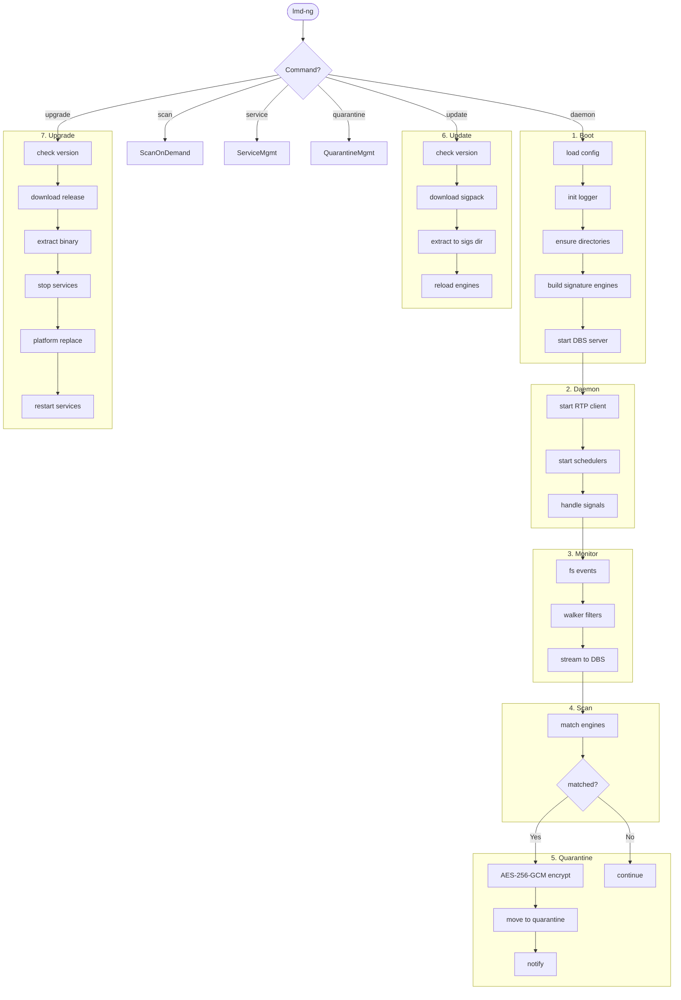
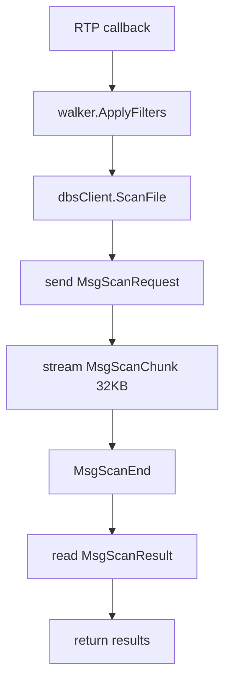
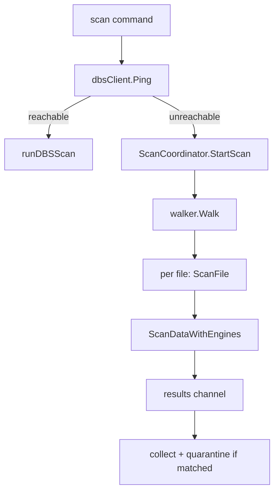
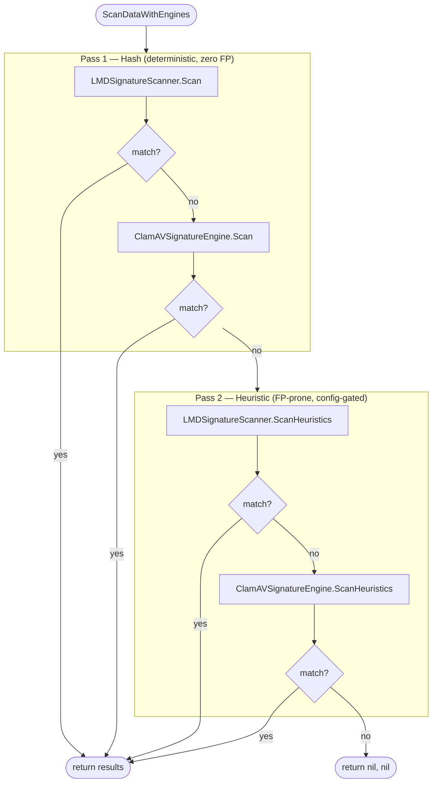

# LMD-NG — Workflows

Step-by-step data flow: config load → daemon startup → signature scanning → quarantine.

---

## Pipeline Overview

---

## Stage Details

### 1. Startup (`cmd/lmd-ng/main.go`, `cmd/lmd-ng/daemon.go`)

1. **Config:** `config.NewConfigManager()` — search binary dir → `/etc/lmd-ng/` → `/usr/local/etc/lmd-ng/` → `/usr/local/lmd-ng/`. Resolve all paths relative to binary's directory.
2. **Logger:** `log.InitLogger()` — dual output (stdout + lumberjack file) when `output: "file"`.
3. **Ensure dirs:** Create `logs/`, `sigs/`, `quarantine/`, `clamav/` (if enabled).
4. **Build engines:** `buildEngines(cfg)` — always create `LMDSignatureScanner` (loads LMD native: MD5 + SHA256 + HEX, plus RFXN: HDB + MDB + NDB via `pkg/clamav`). Hash-based sub-scanners (MD5, SHA256, RFXN HDB, RFXN MDB) are always active. Heuristic sub-scanners (HEX, RFXN NDB) are gated by `enabled_heuristics` config. If `clamav_enabled: true`, also create `ClamAVSignatureEngine` (HDB + MDB always active; NDB gated by `enabled_heuristics`).
5. **Start DBS:** `dbs.NewServer(cfg, engines)` — set `EngineFactory` for hot-reload. `server.Serve(ctx)` enters accept loop.
6. **SIGHUP goroutine:** `handleConfigReload()` — re-read YAML, swap config atomically. Triggers `EngineFactory` to rebuild engines.

### 2. Signature Update (`internal/updater/updater.go`)

**LMD signatures:**
1. Check internet (`util.HasInternetAccess()` — TCP dial `google.com:443`, 2s timeout)
2. Fetch remote version from `signature_version_url`
3. Compare with local `<sigs_dir>/maldet.sigs.ver`
4. If different: download `.tgz` to temp file → extract entries:
   - `maldet.sigs.ver` → `<sigs_dir>/`
   - `md5v2.dat`, `sha256v2.dat`, `hex.dat` → `<sigs_dir>/dat/`
   - `rfxn.*` → `<sigs_dir>/rfxn/`
5. All writes atomic (`.tmp` + rename)
6. Scheduler calls `server.ReloadEngines()` directly after successful update (swap under `sync.RWMutex`)

**ClamAV databases** (when `clamav_update_enabled` + `clamav_enabled`):
1. Uses `If-Modified-Since` header (304 if unchanged)
2. Downloads each DB (`daily.cvd`, `bytecode.cvd`, `main.cvd`) independently
3. User-Agent: `ClamAV/<version>` (fetched from GitHub releases API, fallback `1.5.2`)

### 3. File System Monitoring (`internal/monitor/`)

**macOS** (`monitor_darwin.go` — FSEvents):
- Pre-creates buffered event channels (8192 cap) to prevent GCD deadlocks
- Multiplexes all stream channels into single `merged` channel (4096 cap)
- Events: `ItemCreated | ItemModified | ItemRenamed` → scan

**Linux/Windows** (`monitor_other.go` — fsnotify):
- Recursive walk adds each directory to watcher individually
- New directories at runtime auto-added to watcher
- Same event filtering as macOS

**Filtering (both platforms):**
- Skip: quarantine artifacts, `lmd-scan-*` temp files, `#*` orphan temp files in system temp dirs, `.#*` lock files (Emacs/GnuPG), orphan inodes (Nlink==0), excluded dirs
- Skip: DBS scan temp files in app base tmp directory
- Directories: created dirs added to monitor, removed dirs unwatched (Linux/Windows) or logged (macOS)
- Each event handled in its own goroutine

### 4. Scan Flow

#### DBS Path (normal)

#### Local Fallback (DBS unavailable)

#### ScanDataWithEngines (shared by both paths)

Two-pass architecture: Pass 1 runs all engines' hash-based `Scan()` (deterministic, zero FP), then Pass 2 runs `ScanHeuristics()` on engines implementing `HeuristicScanner` (pattern-based, FP-prone, config-gated). Hash matches always take priority.

**Pass 1 details:**
- Each engine's `Scan()` is hash-only: MD5, SHA256, RFXN HDB, RFXN MDB (LMDSignatureScanner); ClamAV HDB, ClamAV MDB (ClamAVSignatureEngine)
- Short-circuits on first detection across all engines

**Pass 2 details:**
- Only runs if Pass 1 found no match
- Each engine's `ScanHeuristics()` is individually gated by `enabled_heuristics` config
- LMDSignatureScanner: HEX patterns + RFXN NDB (if `"ndb"` enabled)
- ClamAVSignatureEngine: ClamAV NDB (if `"ndb"` enabled)
- Short-circuits on first detection across all engines

### 5. Detection & Quarantine

1. **Match:** Engine returns `[]*ScanResult` (signature name + detection type)
2. **Quarantine check:** If `quarantine.enabled` and match found:
3. **Capture metadata:** `os.Lstat` (no symlink follow) — FileMode, UID/GID, ModTime, FileSize
4. **Generate ID:** 16 random bytes → 32-char hex
5. **Encrypt:** Random 32-byte AES-256-GCM key → single-pass encrypt → encrypt file key with master key (SHA-256 of config password)
6. **Atomic move:** `os.Rename` to quarantine dir (fallback copy+delete for cross-device)
7. **Lock:** `chmod 0o000`
8. **Sidecar:** Write `.metadata.json` (permission `0o600`)
9. **Notify:** `notifier.SendQuarantineNotification()` — Email + Telegram (checks internet connectivity first)

### 6. Scheduled Scans

**UpdateScheduler** (lives with DBS):
- Cron from `scheduler.update_interval` (default `@daily`)
- Job: `updater.Update(ctx)` (5min timeout) → on success: `server.ReloadEngines()`

**ScanScheduler** (lives with RTP):
- Cron from `scheduler.scan_interval` (default `@every 4h`)
- Job: iterate `monitor.paths` → `dbsClient.ScanFile` per path (2hr timeout)
- Uses same streaming mechanism as real-time monitor

### 7. On-Demand Scan (`cmd/lmd-ng/scan.go`)

1. Parse args: `lmd-ng scan <path>`
2. Try DBS first: `dbsClient.Ping(ctx)` (single check)
3. If reachable: `dbsClient.ScanFile(path)` for each matched path
4. If unreachable: fall back to `ScanCoordinator.StartScan(ctx, path, quarantineMgr)` — local scan using engines directly

### 8. Upgrade (`cmd/lmd-ng/upgrade.go`, `internal/upgrade/`)

1. **Version check:** `Upgrader.LatestVersion(ctx)` → GitHub Releases API → returns `(tag, commitish)`
2. **Compare:** If same version + same commit → exit (up-to-date). `--force` skips this.
3. **Download:** `Upgrader.DownloadRelease(ctx, tag, goos, goarch)` → download zip to temp file → extract lmd-ng binary
4. **Detect services:** Check if `lmd-ng-dbs` / `lmd-ng-rtp` are installed
5. **Stop services:** Stop RTP first (if installed), then DBS (if installed)
6. **Wait:** 1 second for services to fully exit
7. **Replace binary:** Platform-specific:
   - **Unix:** `os.Rename` old → `lmd-ng.old`, then `os.Rename` new → `lmd-ng`, `chmod 0755`. Cross-device fallback: `copyFile`
   - **Windows:** Copy new binary as `lmd-ng.exe.new`, write `upgrade-finalize.bat` trampoline (waits 2s, moves new over old, starts services, self-deletes)
8. **Restart services:** Start DBS first (if installed), then RTP (after 1s delay)

---

## File Naming Conventions

| File | Location | Pattern |
|---|---|---|
| Config file | project root | `config.yaml` |
| Config example | project root | `config.yaml.example` |
| Binary | `dist/` | `lmd-ng` |
| LMD signatures | `<sigs_dir>/dat/` | `md5v2.dat`, `sha256v2.dat`, `hex.dat` |
| RFXN signatures | `<sigs_dir>/rfxn/` | `rfxn.*` |
| LMD version | `<sigs_dir>/` | `maldet.sigs.ver` |
| ClamAV databases | `<clamav_dir>/` | `daily.cvd`, `bytecode.cvd`, `main.cvd` |
| Quarantined file | `<quarantine_dir>/` | `<basename>.<32-char-hex>.quarantined` |
| Quarantine metadata | `<quarantine_dir>/` | `<quarantined-path>.metadata.json` |
| TLS certificates | `<base_path>/certs/` | `ca.crt`, `ca.key`, `server.crt`, `server.key`, `client.crt`, `client.key` (auto-generated) |
| Log file | `<logs_dir>/` | `lmd-ng.log` |
| Unix socket | `<base_path>/` | `lmd-ng.sock` |

---

## Error Recovery

| Scenario | Recovery |
|---|---|
| DBS unreachable from RTP | `WaitForServer` retries 30×2s, blocks startup until DBS online |
| Connection dropped mid-scan | Client retry loop: 2 attempts, 1s delay after pool drain. Connection errors drain all pooled connections before retry with fresh dial. File-level errors not retried. Pooled connections health-checked before reuse, idle timeout 4 minutes. |
| Lock file event (`.#` files) | Filtered at monitor layer — no stat, no scan. Zero noise |
| Permission denied during walk | Log at Warn/Debug, `continue` to next file. Never abort scan |
| Quarantine encryption fails | Log error, file remains unquarantined. Scan continues |
| SIGHUP reload fails | Log error, old config remains active. Engines unaffected |
| Signature download fails | Log error, existing signatures remain. Update skipped |
| Internet offline (notifications) | `MultiNotifier` checks `HasInternetAccess()` before dispatch. Silently drops if offline |
| Symlink in walk path | Resolved via `filepath.EvalSymlinks` on root; symlinks rejected at scan entry points (DBS client, ScanCoordinator) via `os.Lstat` |
| Cross-device quarantine move | Falls back to copy+delete when `os.Rename` returns `EXDEV` |
| Upgrade download fails | Log error, exit 1. No binary modified |
| Upgrade service stop fails | Log warning, continue. Binary still replaced |
| Upgrade binary replace fails | Log error, exit 1. Old binary backed up as `.old` |
