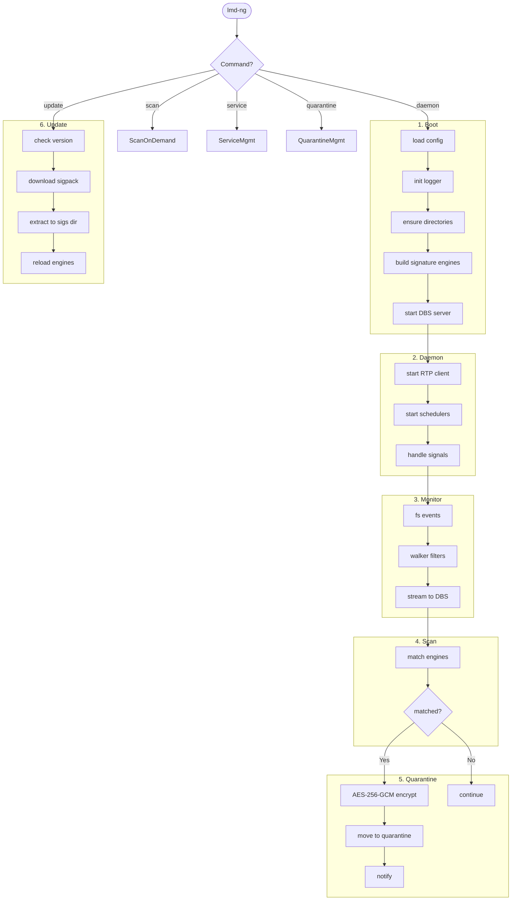

# LMD-NG — Workflows

Step-by-step data flow: config load → daemon startup → signature scanning → quarantine.

---

## Pipeline Overview



---

## Stage Details

### 1. Startup (`cmd/lmd-ng/main.go`, `cmd/lmd-ng/daemon.go`)

1. **Config:** `config.NewConfigManager()` — search binary dir → `/etc/lmd-ng/` → `/usr/local/etc/lmd-ng/` → `/usr/local/lmd-ng/`. Resolve all paths relative to binary's directory.
2. **Logger:** `log.InitLogger()` — dual output (stdout + lumberjack file) when `output: "file"`.
3. **Ensure dirs:** Create `logs/`, `sigs/`, `quarantine/`, `clamav/` (if enabled).
4. **Build engines:** `buildEngines(cfg)` — always create `LMDSignatureScanner` (loads MD5 + SHA256 + HEX + RFXN signatures). If `clamav_enabled: true`, also create `ClamAVSignatureEngine`.
5. **Start DBS:** `dbs.NewServer(cfg, engines)` — set `EngineFactory` for hot-reload. `server.Serve(ctx)` enters accept loop.
6. **SIGHUP goroutine:** `handleConfigReload()` — re-read YAML, swap config atomically. Triggers `EngineFactory` to rebuild engines.

### 2. Signature Update (`internal/updater/updater.go`)

**LMD signatures:**
1. Check internet (`util.HasInternetAccess()` — TCP dial `google.com:443`, 2s timeout)
2. Fetch remote version from `signature_version_url`
3. Compare with local `<sigs_dir>/maldet-sigpack.ver`
4. If different: download `.tgz` to temp file → extract entries:
   - `maldet.sigpack.ver` → `<sigs_dir>/`
   - `md5v2.dat`, `sha256v2.dat`, `hex.dat` → `<sigs_dir>/dat/`
   - `rfxn.*` → `<sigs_dir>/rfxn/`
5. All writes atomic (`.tmp` + rename)
6. `OnSignaturesUpdated` callback → DBS `ReloadEngines()` (swap under `sync.RWMutex`)

**ClamAV databases** (when `clamav_update_enabled` + `clamav_enabled`):
1. Uses `If-Modified-Since` header (304 if unchanged)
2. Downloads each DB (`daily.cvd`, `bytecode.cvd`, `main.cvd`) independently
3. User-Agent: `ClamAV/<version>` (fetched from GitHub releases API, fallback `1.5.2`)

### 3. File System Monitoring (`internal/monitor/`)

**macOS** (`monitor_darwin.go` — FSEvents):
- Pre-creates buffered event channels (8192 cap) to prevent GCD deadlocks
- Multiplexes all stream channels into single `merged` channel (4096 cap)
- Events: `ItemCreated | ItemModified | ItemRenamed` → scan

**Linux/Windows** (`monitor_other.go` — fsnotify):
- Recursive walk adds each directory to watcher individually
- New directories at runtime auto-added to watcher
- Same event filtering as macOS

**Filtering (both platforms):**
- Skip: quarantine artifacts (`.enc.tmp`, `.dec.tmp`, `.quarantined`, `.metadata.json`), directories, excluded paths
- Each event handled in its own goroutine

### 4. Scan Flow

**DBS path (normal):**
```
RTP callback → walker.ApplyFilters → dbsClient.ScanFile
→ send MsgScanRequest → stream MsgScanChunk (32KB) → MsgScanEnd
→ read MsgScanResult → return
```

**Local fallback (DBS unavailable):**
```
scan command → dbsClient.WaitForServer (30 retries × 2s)
→ if unreachable → ScanCoordinator.StartScan
→ walker.Walk → per file: ScanFile → ScanDataWithEngines
→ results channel → collect + quarantine if matched
```

**ScanDataWithEngines** (shared by both paths):
- Iterates engines sequentially, rewinds reader to byte 0 before each
- Short-circuits on first positive detection

### 5. Detection & Quarantine

1. **Match:** Engine returns `[]*ScanResult` (signature name + detection type)
2. **Quarantine check:** If `quarantine.enabled` and match found:
3. **Capture metadata:** `os.Lstat` (no symlink follow) — FileMode, UID/GID, ModTime, FileSize
4. **Generate ID:** 16 random bytes → 32-char hex
5. **Encrypt:** Random 32-byte AES-256-GCM key → encrypt in 4KB chunks → encrypt file key with master key (SHA-256 of config password)
6. **Atomic move:** `os.Rename` to quarantine dir (fallback copy+delete for cross-device)
7. **Lock:** `chmod 0o000`
8. **Sidecar:** Write `.metadata.json` (permission `0o600`)
9. **Notify:** `notifier.SendQuarantineNotification()` — Email + Telegram (checks internet connectivity first)

### 6. Scheduled Scans

**UpdateScheduler** (lives with DBS):
- Cron from `scheduler.update_interval` (default `@daily`)
- Job: `updater.Update(ctx)` (5min timeout) → on success: `server.ReloadEngines()`

**ScanScheduler** (lives with RTP):
- Cron from `scheduler.scan_interval` (default `@every 4h`)
- Job: iterate `monitor.paths` → `dbsClient.ScanFile` per path (2hr timeout)
- Uses same streaming mechanism as real-time monitor

### 7. On-Demand Scan (`cmd/lmd-ng/scan.go`)

1. Parse args: `lmd-ng scan <path>`
2. Try DBS first: `dbsClient.WaitForServer(ctx)` (30 retries × 2s)
3. If reachable: `dbsClient.ScanFile(path)` for each matched path
4. If unreachable: fall back to `ScanCoordinator.StartScan(ctx, path, quarantineMgr)` — local scan using engines directly

---

## File Naming Conventions

| File | Location | Pattern |
|---|---|---|
| Config file | project root | `config.yaml` |
| Config example | project root | `config.yaml.example` |
| Binary | `dist/` | `lmd-ng` |
| LMD signatures | `<sigs_dir>/dat/` | `md5v2.dat`, `sha256v2.dat`, `hex.dat` |
| RFXN signatures | `<sigs_dir>/rfxn/` | `rfxn.*` |
| LMD version | `<sigs_dir>/` | `maldet-sigpack.ver` |
| ClamAV databases | `<clamav_dir>/` | `daily.cvd`, `bytecode.cvd`, `main.cvd` |
| Quarantined file | `<quarantine_dir>/` | `<basename>.<32-char-hex>.quarantined` |
| Quarantine metadata | `<quarantine_dir>/` | `<quarantined-path>.metadata.json` |
| TLS certificates | `<base_path>/certs/` | `server.crt`, `server.key` (auto-generated) |
| Log file | `<logs_dir>/` | `lmd-ng.log` |
| Unix socket | `<base_path>/` | `lmd-ng.sock` |

---

## Error Recovery

| Scenario | Recovery |
|---|---|
| DBS unreachable from RTP | `WaitForServer` retries 30×2s, blocks startup until DBS online |
| Connection dropped mid-scan | Client retry loop: 3 attempts, 1s backoff. Connection only returned to pool on success (`connHealthy` flag) |
| Permission denied during walk | Log at Warn/Debug, `continue` to next file. Never abort scan |
| Quarantine encryption fails | Log error, file remains unquarantined. Scan continues |
| SIGHUP reload fails | Log error, old config remains active. Engines unaffected |
| Signature download fails | Log error, existing signatures remain. Update skipped |
| Internet offline (notifications) | `MultiNotifier` checks `HasInternetAccess()` before dispatch. Silently drops if offline |
| Symlink in walk path | Resolved via `filepath.EvalSymlinks` on root, `os.Stat` on each file |
| Cross-device quarantine move | Falls back to copy+delete when `os.Rename` returns `EXDEV` |
